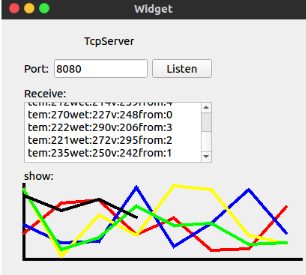

## A Good TcpServer

---

#### First of all, i have to thank one of my friends. It is because of her that i decide to share what i code. Even what i code is simple. 

## Introduction

---

#### I used to design a tcp server that only supports single connection. After the improvement, I can now support multiple clients, and can draw the messages sent by each client and display them dynamically.

## The interface is as follows:

#### As you can see, here is the widget :

#### Thanks for reading. 